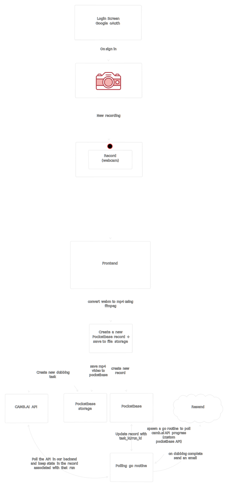

# CAMB.AI x GPEC Hackathon

> [!NOTE]
> This repository is the frontend of the project.
> The backend is implemented in go using pocketbase as a framework and extending it. [Link to Backend](https://github.com/Gaurav-Gosain/cambai-gpec-backend)

## Steps to setup the `Next.js` Frontend

### Pre-requisites/setup
- Have a package manager for node installed, in my case I perfer `bun` so the following steps will use bun.
- Get an API key from the camb.ai dashboard (https://studio.camb.ai). And set the environment variable `CAMB_API_KEY` appropriately (e.g. `.env` file [here](.env.example))
- Set the `NEXT_PUBLIC_PB_URL` env variable with the base URL for the hosted pocketbase endpoint. If developing locally, set it to `http://localhost:8090`.

### Running
- Install the dependencies using `bun install` or the equivalent command of the package manager of choice.
- Run the frontend using `bun run dev` or the equivalent command of the package manager of choice.

> [!WARNING]
> Docs for setting up the [backend](https://github.com/Gaurav-Gosain/cambai-gpec-backend) are WIP ⚠️